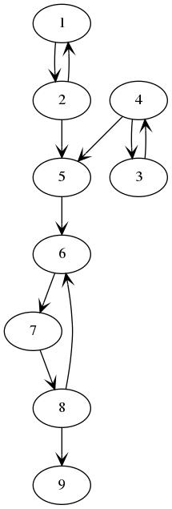
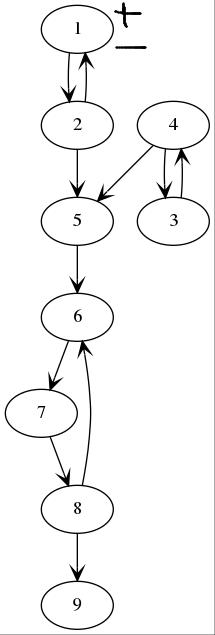
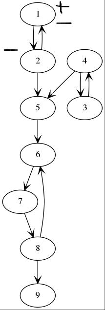
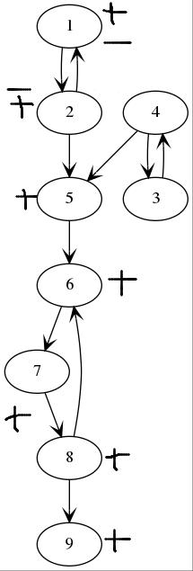
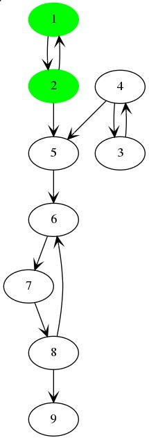
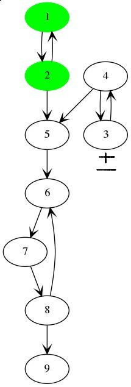
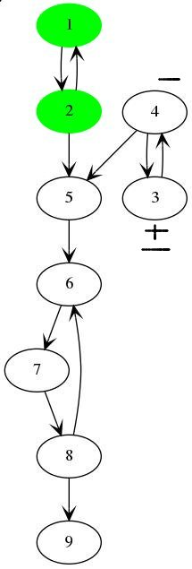
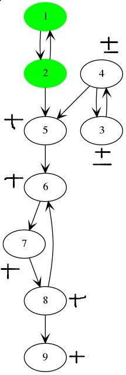
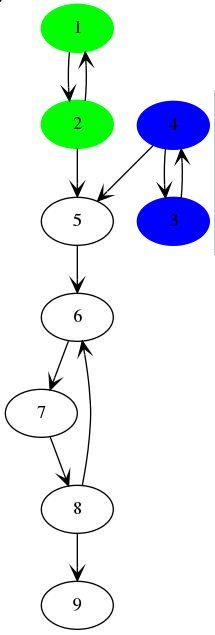

# Composantes Fortement Connexes (CFC)

Etant donnée un graph orienté G(V, A), où V est l'ensemble des noeuds et A est l'ensemble des arcs, on dit qu'un sous graph G'(V',A') de G forme une composante fortement connexe si et seulement si quelque soit deux noeuds u, v de V' il existe un chemin de u vers v.

## Quelques applications

* Identifier des relations fortes entre les groupes sur les réseaux sociaux.
* La base de plusieurs techniques de vérification de systèmes ([2-SAT](https://fr.wikipedia.org/wiki/Problème_2-SAT), [Model-Checking](https://fr.wikipedia.org/wiki/Vérification_de_modèles)...)

## Algorithme initial

En démarrant d'un noeud non affecté à une CFC, on le marque par (+) et (-) et on marque récursivement les noeuds successeurs par (+) et les noeuds prédécesseurs par (-). Les noeuds étant marqués (+) et (-) forment une CFC. On refait la même opération pour les noeuds restants jusqu'à ce que tous les neouds soient tous affectés à une CFC.

Dans un graph G(V, A) où V est l'ensemble des noeuds et A est l'ensemble des arcs, on définit quelques variables:
* __P__: l'ensemble des noeuds marqués (+) (remplis par la fonction marquer_successeurs)
* __M__: l'ensemble des noeuds marqués (-) (remplis par la fonction marquer_prédécesseurs
* __R__: l'ensemble des noeuds restants (qui ne sont pas encore affectés à une composante connexe)
* __S__: l'ensemble des composantes fortement connexes; c'est un ensemble des ensembles des neouds.
* __C__: l'ensemble des noeuds formants une composante fortement connexe

```
ALGORITHME cfc-initial
ENTREES: G(V, A)
SORTIE: S
VARIABLES GLOBALES:
        S = ∅ //L'ensemble des CFC
        R = V //L'ensemble des noeuds restants
        P = ∅ //L'ensemble des noeuds marqués +
        M = ∅ //L'ensemble des noeuds marqués -

PROCEDURE marquer_prédécesseurs(v)
   POUR CHAQUE (u, v) ∈ A FAIRE
      SI u ∈ (R-M) FAIRE // u ∈ R ET u ∉ M
         M = M ∪ {u}
         marquer_prédécesseurs(u)
      FIN SI
   FIN POUR
FIN PROCEDURE

PROCEDURE marquer_successeurs(v)
   POUR CHAQUE (v, u) ∈ A FAIRE
      SI u ∈ (R-P) FAIRE  //u ∈ R ET u ∉ P
         P = P ∪ {u}
         marquer_successeurs(u)
      FIN SI
   FIN POUR
FIN PROCEDURE

DEBUT
   POUR CHAQUE v ∈ R FAIRE
      P = {v}
      M = {v}
      marquer_prédécesseurs(v)
      marquer_successeurs(v)
      C =  P ∩ M //Les noeuds marqués + et -
      S = S ∪ {C}
      R = R - C
   FIN POUR
FIN
```

Exemple:










...


## Algorithme de Kosaraju

Liens:
* Sur [Wikipedia](https://fr.wikipedia.org/wiki/Algorithme_de_Kosaraju)
* Sur [geeksforgeeks](https://www.geeksforgeeks.org/strongly-connected-components/) avec un code en C++, Java et Python.
* [Une implémentation en Python](https://github.com/ladamalina/coursera-algo/blob/master/PQ4.%20SCCs/kosaraju.py)
* [Une autre en Python](https://github.com/TheAlgorithms/Python/blob/master/Graphs/scc_kosaraju.py)
* [Une autre en Python](https://gist.github.com/JeremieGomez/74de2d3e1268c48e63a3)

## Algorithme de Tarjan

Liens:
* Sur [Wikipedia](https://fr.wikipedia.org/wiki/Algorithme_de_Tarjan)
* [Une implémentation en Python](https://github.com/bwesterb/py-tarjan/)
* [Une autre en Python](https://github.com/TheAlgorithms/Python/blob/master/Graphs/tarjans_scc.py)


## Implémentations

Dans nos examples, nous allons utiliser des [Listes d'adjacence](https://fr.wikipedia.org/wiki/Liste_d%27adjacence) pour représenter un graph.
